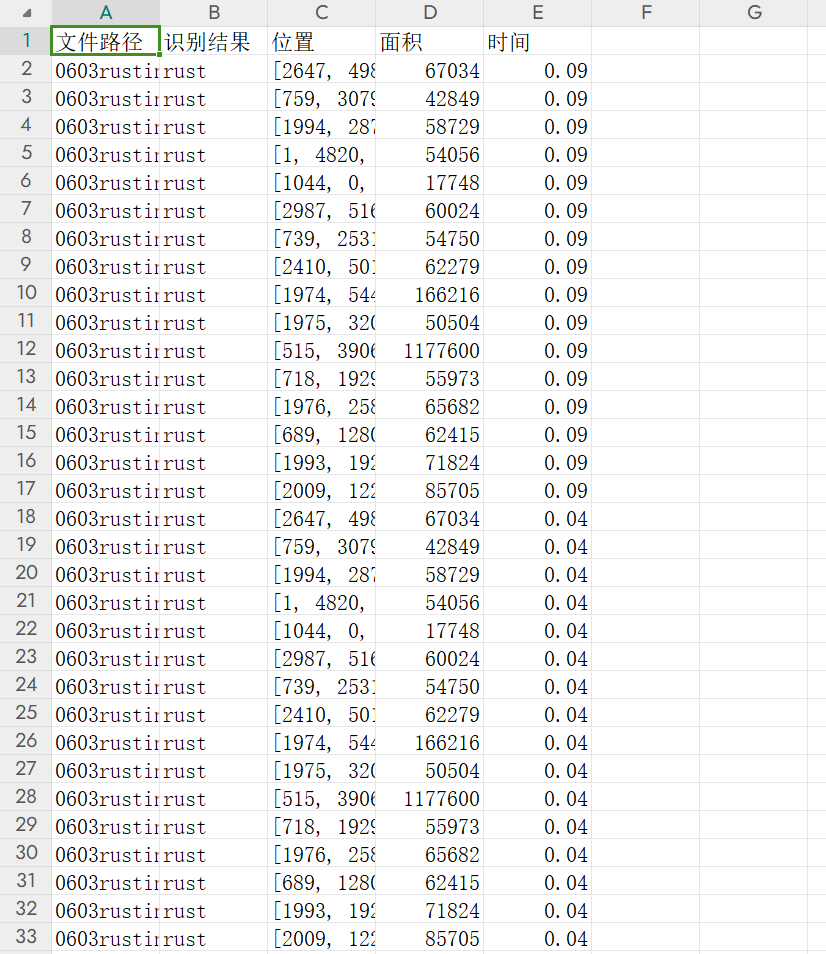

# 碎石传送带图像分割系统： yolov8-seg-C2f-Parc

### 1.研究背景与意义

[参考博客](https://gitee.com/YOLOv8_YOLOv11_Segmentation_Studio/projects)

[博客来源](https://kdocs.cn/l/cszuIiCKVNis)

研究背景与意义

随着工业自动化的快速发展，碎石传送带在矿业、建筑及其他相关领域的应用日益广泛。传送带系统不仅提高了物料搬运的效率，还在一定程度上降低了人工成本。然而，碎石传送带的运行过程中，如何准确识别和分割不同类型的物料，尤其是在复杂的工作环境中，仍然是一个亟待解决的技术难题。传统的图像处理方法在处理多类别物体时，往往面临识别精度不足、实时性差等问题。因此，基于深度学习的图像分割技术逐渐成为研究的热点。

YOLO（You Only Look Once）系列模型以其快速的实时检测能力和较高的准确率，成为目标检测领域的重要工具。YOLOv8作为该系列的最新版本，结合了多种先进的技术，展现出更为优越的性能。然而，针对特定应用场景，如碎石传送带的图像分割，YOLOv8仍存在一些局限性，例如对小物体的识别能力不足和背景复杂度对检测结果的影响。因此，改进YOLOv8以适应碎石传送带的特定需求，具有重要的研究价值和实际意义。

本研究基于GBB_Scrap_Pebble_Band_v1数据集，该数据集包含1800张图像，涵盖了四个类别：球体（ball）、带子（banda）、物体（object）和碎石（pebble）。这些类别的多样性为模型的训练和测试提供了丰富的样本，有助于提升模型在实际应用中的泛化能力。通过对这些图像进行实例分割，可以实现对不同物体的精确定位和识别，从而为后续的自动化处理提供可靠的数据支持。

在研究意义上，改进YOLOv8的碎石传送带图像分割系统不仅能够提升物料识别的准确性，还能在实时监控、故障检测和智能调度等方面发挥重要作用。通过提高传送带系统的智能化水平，可以有效降低人为干预的需求，减少因操作失误导致的事故风险。此外，该系统的成功应用还将为其他工业领域的图像分割技术提供借鉴，推动相关技术的进一步发展。

综上所述，基于改进YOLOv8的碎石传送带图像分割系统的研究，不仅具有重要的理论价值，也具备广泛的应用前景。通过深入探讨和解决现有技术的不足之处，本研究旨在为碎石传送带的智能化发展提供切实可行的解决方案，推动相关领域的技术进步与创新。

### 2.图片演示


注意：本项目提供完整的训练源码数据集和训练教程,由于此博客编辑较早,暂不提供权重文件（best.pt）,需要按照6.训练教程进行训练后实现上图效果。

### 3.视频演示

[3.1 视频演示](https://www.bilibili.com/video/BV1pym1Y4ESc/)

### 4.数据集信息

##### 4.1 数据集类别数＆类别名

nc: 3
names: ['ball', 'banda', 'pebble']


##### 4.2 数据集信息简介

数据集信息展示

在现代计算机视觉领域，图像分割技术的应用日益广泛，尤其是在工业自动化和物料处理方面。为此，针对碎石传送带的图像分割任务，我们构建了一个名为“GBB_Scrap_Pebble_Band_v1”的数据集，以支持对YOLOv8-seg模型的训练和优化。该数据集专注于对碎石传送带上不同物体的精确识别与分割，旨在提高物料处理的效率和准确性。

“GBB_Scrap_Pebble_Band_v1”数据集包含三类主要物体，分别是“ball”（球体）、“banda”（带子）和“pebble”（碎石）。这些类别的选择是基于实际应用场景中常见的物体，能够有效地模拟碎石传送带上的工作环境。每一类物体都具有独特的视觉特征和形态，要求模型在训练过程中能够捕捉到这些细微的差异，以实现高效的分割效果。

在数据集的构建过程中，我们采集了大量的图像数据，涵盖了不同的光照条件、视角和背景。这种多样性确保了模型在实际应用中具备良好的泛化能力。数据集中包含的图像不仅有清晰的物体边界，还有一些在复杂背景下的实例，以挑战模型的分割能力。此外，为了提高数据集的质量，我们对图像进行了精细的标注，确保每个物体的轮廓和类别信息准确无误。

为了便于模型的训练和评估，数据集采用了标准的图像分割格式，包含了每个图像对应的掩码图（mask），标注了各个物体的像素级别信息。这种精细的标注方式使得模型能够学习到更为复杂的空间关系，从而在分割任务中表现出色。数据集的设计不仅考虑到了物体的外观特征，还充分考虑了物体之间的相互关系和遮挡情况，这对于提升模型的分割精度至关重要。

在进行YOLOv8-seg模型的训练时，我们将“GBB_Scrap_Pebble_Band_v1”数据集分为训练集、验证集和测试集，以确保模型的训练过程能够有效评估其性能。训练集用于模型的学习，验证集用于调整超参数和避免过拟合，而测试集则用于最终的性能评估。这种划分方式能够确保模型在不同数据集上的表现具有一致性和可靠性。

总之，“GBB_Scrap_Pebble_Band_v1”数据集为改进YOLOv8-seg的碎石传送带图像分割系统提供了坚实的基础。通过对不同类别物体的精确标注和多样化的图像采集，该数据集不仅能够帮助研究人员和工程师更好地理解碎石传送带上的物体特征，还能推动相关技术的进步与应用。随着数据集的不断完善和扩展，我们期待能够在未来的研究中实现更高效、更准确的图像分割解决方案。


### 5.项目依赖环境部署教程（零基础手把手教学）

[5.1 环境部署教程链接（零基础手把手教学）](https://www.bilibili.com/video/BV1jG4Ve4E9t/?vd_source=bc9aec86d164b67a7004b996143742dc)


[5.2 安装Python虚拟环境创建和依赖库安装视频教程链接（零基础手把手教学）](https://www.bilibili.com/video/BV1nA4VeYEze/?vd_source=bc9aec86d164b67a7004b996143742dc)

### 6.手把手YOLOV8-seg训练视频教程（零基础手把手教学）

[6.1 手把手YOLOV8-seg训练视频教程（零基础小白有手就能学会）](https://www.bilibili.com/video/BV1cA4VeYETe/?vd_source=bc9aec86d164b67a7004b996143742dc)


按照上面的训练视频教程链接加载项目提供的数据集，运行train.py即可开始训练



     Epoch   gpu_mem       box       obj       cls    labels  img_size
     1/200     0G   0.01576   0.01955  0.007536        22      1280: 100%|██████████| 849/849 [14:42<00:00,  1.04s/it]
               Class     Images     Labels          P          R     mAP@.5 mAP@.5:.95: 100%|██████████| 213/213 [01:14<00:00,  2.87it/s]
                 all       3395      17314      0.994      0.957      0.0957      0.0843

     Epoch   gpu_mem       box       obj       cls    labels  img_size
     2/200     0G   0.01578   0.01923  0.007006        22      1280: 100%|██████████| 849/849 [14:44<00:00,  1.04s/it]
               Class     Images     Labels          P          R     mAP@.5 mAP@.5:.95: 100%|██████████| 213/213 [01:12<00:00,  2.95it/s]
                 all       3395      17314      0.996      0.956      0.0957      0.0845

     Epoch   gpu_mem       box       obj       cls    labels  img_size
     3/200     0G   0.01561    0.0191  0.006895        27      1280: 100%|██████████| 849/849 [10:56<00:00,  1.29it/s]
               Class     Images     Labels          P          R     mAP@.5 mAP@.5:.95: 100%|███████   | 187/213 [00:52<00:00,  4.04it/s]
                 all       3395      17314      0.996      0.957      0.0957      0.0845


### 7.50+种全套YOLOV8-seg创新点加载调参实验视频教程（一键加载写好的改进模型的配置文件）

[7.1 50+种全套YOLOV8-seg创新点加载调参实验视频教程（一键加载写好的改进模型的配置文件）](https://www.bilibili.com/video/BV1Hw4VePEXv/?vd_source=bc9aec86d164b67a7004b996143742dc)

### YOLOV8-seg算法简介

原始YOLOv8-seg算法原理

YOLOv8-seg算法是YOLO系列目标检测模型中的一个重要扩展，专注于目标的分割任务，结合了目标检测与图像分割的优势。作为YOLOv8的一个变种，YOLOv8-seg不仅保留了YOLOv8在目标检测方面的高效性和准确性，还通过引入分割机制，增强了对复杂场景中目标形状和边界的理解能力。这一算法的核心在于其网络结构的设计和功能的整合，主要由Backbone、Neck和Head三部分组成。

在Backbone部分，YOLOv8-seg采用了CSPDarknet结构，充分利用了残差学习的优势。CSPDarknet将特征提取过程分为两个主要分支，每个分支都包含多个残差块，以此来增强特征的表达能力。与前代模型相比，YOLOv8-seg使用了C2f模块替代了C3模块，这一创新设计使得特征图在经过卷积处理后，能够被分成两个独立的分支进行进一步的处理。每个分支经过卷积层进行降维处理后，再通过堆叠形成更高维度的特征图，这种设计不仅提升了特征提取的效率，还增加了网络的深度和复杂性，从而使得模型能够捕捉到更丰富的特征信息。

Neck部分则引入了特征金字塔网络（FPN）和路径聚合网络（PAN），通过多层次的特征融合，进一步提升了模型对不同尺度目标的检测能力。特征金字塔网络能够有效地处理多尺度特征，使得模型在面对不同大小的目标时，依然能够保持较高的检测精度。PAN结构则通过对特征图的进一步处理和压缩，确保了信息的有效传递，增强了模型的整体性能。

在Head部分，YOLOv8-seg采用了无锚框（Anchor-Free）的检测方式，这一方法使得模型能够直接预测目标的中心点及其宽高比例，省去了传统锚框设计的复杂性。这种简化不仅提高了检测速度，还在一定程度上提升了检测的准确性，尤其是在目标形状不规则或重叠较多的情况下，YOLOv8-seg能够更好地进行目标分割。

此外，YOLOv8-seg在分割任务中引入了特定的损失函数，以便更好地优化分割结果。通过对分割区域的精确标定，YOLOv8-seg能够在复杂背景下有效区分目标与背景，从而实现高质量的分割效果。这一过程不仅依赖于网络结构的设计，还与训练过程中采用的多尺度训练和测试策略密切相关。通过对不同尺度的图像进行训练，模型能够学习到更为丰富的特征，从而在实际应用中表现出更强的鲁棒性。

YOLOv8-seg的应用场景广泛，涵盖了智能监控、自动驾驶、医学影像分析等多个领域。在智能监控中，YOLOv8-seg能够实时检测并分割出监控画面中的人、车等目标，为安全管理提供了有力支持。在自动驾驶领域，精确的目标分割有助于车辆识别行人、交通标志等关键元素，从而提升行车安全。而在医学影像分析中，YOLOv8-seg则能够辅助医生对病灶进行精确定位和分割，提高诊断的准确性。

综上所述，YOLOv8-seg算法通过引入先进的网络结构和无锚框检测方式，成功地将目标检测与图像分割结合在一起，展现出了卓越的性能和灵活性。其在特征提取、特征融合和目标分割等方面的创新，使得YOLOv8-seg成为了一个强大的工具，能够在多种复杂场景中提供高效、准确的目标检测与分割服务。随着技术的不断进步，YOLOv8-seg无疑将在未来的计算机视觉领域中发挥更为重要的作用。


### 9.系统功能展示（检测对象为举例，实际内容以本项目数据集为准）

图9.1.系统支持检测结果表格显示

  图9.2.系统支持置信度和IOU阈值手动调节

  图9.3.系统支持自定义加载权重文件best.pt(需要你通过步骤5中训练获得)

  图9.4.系统支持摄像头实时识别

  图9.5.系统支持图片识别

  图9.6.系统支持视频识别

  图9.7.系统支持识别结果文件自动保存

  图9.8.系统支持Excel导出检测结果数据




### 10.50+种全套YOLOV8-seg创新点原理讲解（非科班也可以轻松写刊发刊，V11版本正在科研待更新）

#### 10.1 由于篇幅限制，每个创新点的具体原理讲解就不一一展开，具体见下列网址中的创新点对应子项目的技术原理博客网址【Blog】：


[10.1 50+种全套YOLOV8-seg创新点原理讲解链接](https://gitee.com/qunmasj/good)

#### 10.2 部分改进模块原理讲解(完整的改进原理见上图和技术博客链接)【如果此小节的图加载失败可以通过CSDN或者Github搜索该博客的标题访问原始博客，原始博客图片显示正常】
### YOLOv8简介
根据官方描述，Yolov8是一个SOTA模型，它建立在Yolo系列历史版本的基础上，并引入了新的功能和改进点，以进一步提升性能和灵活性，使其成为实现目标检测、图像分割、姿态估计等任务的最佳选择。其具体创新点包括一个新的骨干网络、一个新的Ancher-Free检测头和一个新的损失函数，可在CPU到GPU的多种硬件平台上运行。
此外，Yolov8还有一个特点就是可扩展性，ultralytics没有直接将开源库命名为Yolov8，而是直接使用"ultralytcs"，将其定位为算法框架，而非某一个特定算法。这也使得Yolov8开源库不仅仅能够用于Yolo系列模型，而且能够支持非Yolo模型以及分类分割姿态估计等各类任务。
总而言之，Yolov8是Yolo系列模型的最新王者，各种指标全面超越现有对象检测与实例分割模型，借鉴了Yolov5、Yolov6、YoloX等模型的设计优点，在全面提升改进Yolov5模型结构的基础上实现，同时保持了Yolov5工程化简洁易用的优势。

#### Yolov8创新点
Yolov8主要借鉴了Yolov5、Yolov6、YoloX等模型的设计优点，其本身创新点不多，偏重在工程实践上，具体创新如下:
·提供了一个全新的SOTA模型（包括P5 640和P6 1280分辨率的目标检测网络和基于YOLACT的实例分割模型)。并且，基于缩放系数提供了N/S/M/L/X不同尺度的模型，以满足不同部署平台和应用场景的需求。
. Backbone:同样借鉴了CSP模块思想，不过将Yolov5中的C3模块替换成了C2f模块
实现了进—步轻量化，同时沿用Yolov5中的
SPPF模块，并对不同尺度的模型进行精心微调，不再是无脑式一套参数用于所有模型，大幅提升了模型性能。
。Neck:继续使用PAN的思想，但是通过对比YOLOv5与YOLOv8的结构图可以看到，YOLOv8移除了1*1降采样层。
·Head部分相比YOLOv5改动较大，Yolov8换成了目前主流的解耦头结构(Decoupled-Head)，将分类和检测头分离，同时也从Anchor-Based换成了Anchor-Free。
·Loss计算:使用VFLLoss作为分类损失(实际训练中使用BCE Loss);使用DFLLoss+CIOU Loss作为回归损失。
。标签分配: Yolov8抛弃了以往的loU分配或者单边比例的分配方式，而是采用Task-Aligned Assigner正负样本分配策略。
#### Yolov8网络结构
Yolov8模型网络结构图如下图所示。


### Diverse Branch Block简介
参考该博客提出的一种通用的卷积网络构造块用来在不增加任何推理时间的前提下提升卷积网络的性能。我们将这个块命名为分离分支块（Diverse Branch Block）。通过结合不同尺寸和复杂度的分离分支（包括串联卷积、多尺度卷积和平均池化层）来增加特征空间的方法，它提升了单个卷积的表达能力。完成训练后，一个DBB(Diverse Branch Block)可以被等价地转换为一个单独的卷积操作以方便部署。不同于那些新颖的卷积结构的改进方式，DBB让训练时微结构复杂化同时维持大规模结构，因此我们可以将它作为任意结构中通用卷积层的一种嵌入式替代形式。通过这种方式，我们能够将模型训练到一个更高的表现水平，然后在推理时转换成原始推理时间的结构。

 
主要贡献点：

（1） 我们建议合并大量的微结构到不同的卷积结构中来提升性能，但是维持原始的宏观结构。

（2）我们提出DBB，一个通用构造块结构，概括六种转换来将一个DBB结构转化成一个单独卷积，因为对于用户来说它是无损的。

（3）我们提出一个Inception-like DBB结构实例(Fig 1)，并且展示它在ImageNet、COCO detection 和CityScapes任务中获得性能提升。


#### 结构重参数化
本文和一个并发网络RepVGG[1]是第一个使用结构重参数化来命名该思路------使用从其他结构转化来的参数确定当前结构的参数。一个之前的工作ACNet[2]也可以被划分为结构重参数化，它提出使用非对称卷积块来增强卷积核的结构（i.e 十字形结构）。相比于DBB，它被设计来提升卷积网络（在没有额外推理时间损失的条件下）。这个流水线也包含将一个训练好的模型转化为另一个。但是，ACNet和DBB的区别是：ACNet的思想被激发是基于一个观察，这个观察是网络结构的参数在过去有更大的量级，因此寻找方法让参数量级更大，然而我们关注一个不同的点。我们发现 平均池化、1x1 conv 和 1x1-kxk串联卷积是更有效的，因为它们提供了不同复杂度的路线，以及允许使用更多训练时非线性化。除此以外，ACB结构可以看作是DBB结构的一种特殊形式，因为那个1xk和kx1卷积层能够被扩大成kxk（via Transform VI(Fig.2)），然后合并成一个平方核（via Transform II）。

 

#### 分离分支结构
卷积的线性性
一个卷积操作可以表示为 ，其中为输入tensor, 为输出tensor。卷积核表示为一个四阶tensor , 偏置为。将加偏置的操作表示为。

因为，在第j个输出通道（h,w）位置的值可以由以下公式给出：，其中表示输入帧I的第c个通道上的一个滑动窗，对应输出帧O的坐标（h,w）。从上式可以看出，卷积操作具有齐次性和加法性。


注意：加法性成立的条件是两个卷积具有相同的配置（即通道数、核尺寸、步长和padding等）。

#### 分离分支的卷积
在这一小节，我们概括六种转换形式（Fig.2）来转换一个具有batch normalization(BN)、branch addition、depth concatenation、multi-scale operations、avarage pooling 和 sequences of convolutions的DBB分支。


Transform I：a conv for conv-BN  我们通常会给一个卷积配备配备一个BN层，它执行逐通道正则化和线性尺度放缩。设j为通道索引，分别为累积的逐通道均值和标准差，分别为学习的尺度因子和偏置项，对应输出通道j为


卷积的齐次性允许我们融合BN操作到前述的conv来做推理。在实践中，我们仅仅建立一个拥有卷积核和偏置, 用从原始BN序列的参数转换来的值来赋值。我们为每个输出通道j构造


Transform II a conv for branch addition  卷积的加法性确保如果有两个或者多个具有相同配置的卷积层相加，我们能够将它们合并到一个单独的卷积里面。对于conv-BN，我们应该首先执行Transform I。很明显的，通过下面的公式我们能够合并两个卷积


上述公式只有在两个卷积拥有相同配置时才成立。尽管合并上述分支能够在一定程度上增强模型，我们希望结合不同分支来进一步提升模型性能。在后面，我们介绍一些分支的形式，它们能够等价地被转化为一个单独的卷积。在通过多个转化来为每一个分支构造KxK的卷积之后，我们使用Transform II 将所有分支合并到一个conv里面。

Transform III: a conv for sequential convolutions   我们能够合并一个1x1 conv-BN-kxk conv序列到一个kxk conv里面。我们暂时假设卷积是稠密的（即 组数 groups=1）。组数groups>1的情形将会在Transform IV中实现。我们假定1x1和kxk卷积层的核形状分别是DxCx1x1和ExDxKxK，这里D指任意值。首先，我们将两个BN层融合到两个卷积层里面，由此获得。输出是


我们期望用一个单独卷积的核和偏置来表达，设, 它们满足。对方程（8）应用卷积的加法性，我们有


因为是一个1x1 conv，它只执行逐通道线性组合，没有空间聚合操作。通过线性重组KxK卷积核中的参数，我们能够将它合并到一个KxK的卷积核里面。容易证明的是，这样的转换可以由一个转置卷积实现：


其中是由转置获得的tensor张量。方程（10）的第二项是作用于常量矩阵上的卷积操作，因此它的输出也是一个常量矩阵。用表达式来说明，设是一个常数矩阵，其中的每个元素都等于p。*是一个2D 卷积操作，W为一个2D 卷积核。转换结果就是一个常量矩阵，这个常量矩阵是p 与 所有核元素之和 的乘积，即


基于以上观察，我们构造。然后，容易证明。

因此我们有

显而易见地，对于一个zero-pads 的KxK卷积，方程（8）并不成立，因为并不对的结果做卷积操作(如果有一个零元素的额外的圈，方程（8）成立)。解决方案有A)用padding配置第一个卷积，第二个卷积不用，B)通过做pad操作。后者的一个有效实现是定制第一个BN层，为了（1）如通常的batch-normalize输入。（2）计算(通过方程（6）)。（3）用  pad batch-normalized结果，例如 用一圈 pad 每一个通道j 。

Transform IV: a conv for depth concatenation  Inception 单元使用深度concatenation来组合不同分支。当每个分支都只包含一个相同配置的卷积时，深度concatenation等价于一个卷积，它的核在不同的输出通道上concatenation（比如我们公式中的第一个轴）假设。我们concatenate它们到。显然地


Transform IV 可以非常方便地将Transform III 扩展到 groupwise（即 groups > 1） 的情景。直觉上，一个groupwise 卷积将输入分割成g个并行的组，单独卷积它们，然后concatenate形成输出。为了代替g-group卷积，我们建立一个DBB结构，这个结构的所有卷积层有相同的组g。为了转换一个1x1-KxK序列，我们等价地分割它们成为g组，单独执行Transform III, 然后concatenate获得输出（如图Fig3所示）。


Transform V: a conv for average pooling  一个作用于C通道的核尺寸为K，步长为s的平均池化层等价于一个拥有相同核尺寸K,步长s的卷积层。这样的核可以被构造为

  


就像一个通常的平均池化操作，当s>1时执行降采样操作，当s=1时保持相同尺寸。

Transform VI: a conv for multi-scale convolutions   考虑一个等价于一个拥有相同zero padding的 核。特别地，卷积是格外实用的，因为它们能够有效实现。应该对输入作pad操作来对齐滑动窗。


### 11.项目核心源码讲解（再也不用担心看不懂代码逻辑）

#### 11.1 ultralytics\nn\backbone\SwinTransformer.py

以下是对给定代码的核心部分进行分析和详细注释的结果。我们将保留最重要的类和函数，并对其进行中文注释。

```python
import torch
import torch.nn as nn
import torch.nn.functional as F
import numpy as np
from timm.models.layers import DropPath, to_2tuple, trunc_normal_

class Mlp(nn.Module):
    """ 多层感知机 (MLP) 模块。 """

    def __init__(self, in_features, hidden_features=None, out_features=None, act_layer=nn.GELU, drop=0.):
        super().__init__()
        out_features = out_features or in_features  # 输出特征数默认为输入特征数
        hidden_features = hidden_features or in_features  # 隐藏层特征数默认为输入特征数
        self.fc1 = nn.Linear(in_features, hidden_features)  # 第一层线性变换
        self.act = act_layer()  # 激活函数
        self.fc2 = nn.Linear(hidden_features, out_features)  # 第二层线性变换
        self.drop = nn.Dropout(drop)  # Dropout层

    def forward(self, x):
        """ 前向传播函数。 """
        x = self.fc1(x)  # 线性变换
        x = self.act(x)  # 激活
        x = self.drop(x)  # Dropout
        x = self.fc2(x)  # 线性变换
        x = self.drop(x)  # Dropout
        return x


class WindowAttention(nn.Module):
    """ 基于窗口的多头自注意力 (W-MSA) 模块。 """

    def __init__(self, dim, window_size, num_heads, qkv_bias=True, attn_drop=0., proj_drop=0.):
        super().__init__()
        self.dim = dim  # 输入通道数
        self.window_size = window_size  # 窗口大小
        self.num_heads = num_heads  # 注意力头数
        head_dim = dim // num_heads  # 每个头的维度
        self.scale = head_dim ** -0.5  # 缩放因子

        # 定义相对位置偏置参数表
        self.relative_position_bias_table = nn.Parameter(
            torch.zeros((2 * window_size[0] - 1) * (2 * window_size[1] - 1), num_heads))

        # 计算相对位置索引
        coords_h = torch.arange(self.window_size[0])
        coords_w = torch.arange(self.window_size[1])
        coords = torch.stack(torch.meshgrid([coords_h, coords_w]))  # 生成坐标网格
        coords_flatten = torch.flatten(coords, 1)  # 展平坐标
        relative_coords = coords_flatten[:, :, None] - coords_flatten[:, None, :]  # 计算相对坐标
        relative_coords = relative_coords.permute(1, 2, 0).contiguous()  # 调整维度
        relative_coords[:, :, 0] += self.window_size[0] - 1  # 偏移
        relative_coords[:, :, 1] += self.window_size[1] - 1
        relative_coords[:, :, 0] *= 2 * self.window_size[1] - 1
        self.relative_position_index = relative_coords.sum(-1)  # 计算相对位置索引
        self.register_buffer("relative_position_index", self.relative_position_index)

        self.qkv = nn.Linear(dim, dim * 3, bias=qkv_bias)  # 计算Q、K、V
        self.attn_drop = nn.Dropout(attn_drop)  # 注意力权重的Dropout
        self.proj = nn.Linear(dim, dim)  # 输出线性变换
        self.proj_drop = nn.Dropout(proj_drop)  # 输出的Dropout
        trunc_normal_(self.relative_position_bias_table, std=.02)  # 初始化相对位置偏置
        self.softmax = nn.Softmax(dim=-1)  # Softmax层

    def forward(self, x, mask=None):
        """ 前向传播函数。 """
        B_, N, C = x.shape  # 获取输入的形状
        qkv = self.qkv(x).reshape(B_, N, 3, self.num_heads, C // self.num_heads).permute(2, 0, 3, 1, 4)  # 计算Q、K、V
        q, k, v = qkv[0], qkv[1], qkv[2]  # 分离Q、K、V

        q = q * self.scale  # 缩放Q
        attn = (q @ k.transpose(-2, -1))  # 计算注意力得分

        # 添加相对位置偏置
        relative_position_bias = self.relative_position_bias_table[self.relative_position_index.view(-1)].view(
            self.window_size[0] * self.window_size[1], self.window_size[0] * self.window_size[1], -1)
        relative_position_bias = relative_position_bias.permute(2, 0, 1).contiguous()  # 调整维度
        attn = attn + relative_position_bias.unsqueeze(0)  # 加入偏置

        attn = self.softmax(attn)  # 计算Softmax
        attn = self.attn_drop(attn)  # Dropout

        x = (attn @ v).transpose(1, 2).reshape(B_, N, C)  # 计算输出
        x = self.proj(x)  # 线性变换
        x = self.proj_drop(x)  # Dropout
        return x


class SwinTransformer(nn.Module):
    """ Swin Transformer 主体。 """

    def __init__(self, patch_size=4, in_chans=3, embed_dim=96, depths=[2, 2, 6, 2], num_heads=[3, 6, 12, 24]):
        super().__init__()

        # 图像分块嵌入
        self.patch_embed = PatchEmbed(patch_size=patch_size, in_chans=in_chans, embed_dim=embed_dim)

        # 构建层
        self.layers = nn.ModuleList()
        for i_layer in range(len(depths)):
            layer = BasicLayer(
                dim=int(embed_dim * 2 ** i_layer),
                depth=depths[i_layer],
                num_heads=num_heads[i_layer],
                window_size=7,  # 窗口大小
                mlp_ratio=4.,  # MLP比率
                norm_layer=nn.LayerNorm,  # 归一化层
                downsample=PatchMerging if (i_layer < len(depths) - 1) else None)  # 下采样
            self.layers.append(layer)

    def forward(self, x):
        """ 前向传播函数。 """
        x = self.patch_embed(x)  # 嵌入
        outs = []
        for layer in self.layers:
            x_out, _, _, _, _, _ = layer(x)  # 逐层传递
            outs.append(x_out)  # 收集输出
        return outs  # 返回所有层的输出


def SwinTransformer_Tiny(weights=''):
    """ 创建一个小型的Swin Transformer模型。 """
    model = SwinTransformer(depths=[2, 2, 6, 2], num_heads=[3, 6, 12, 24])  # 定义模型
    if weights:
        model.load_state_dict(torch.load(weights)['model'])  # 加载权重
    return model
```

### 代码核心部分说明：
1. **Mlp类**：实现了一个简单的多层感知机，包括两层线性变换和激活函数，支持Dropout。
2. **WindowAttention类**：实现了窗口注意力机制，支持相对位置偏置，计算Q、K、V并应用注意力机制。
3. **SwinTransformer类**：构建了Swin Transformer的主体结构，包括图像分块嵌入和多个基本层（BasicLayer），用于处理输入数据并提取特征。
4. **SwinTransformer_Tiny函数**：创建一个小型的Swin Transformer模型，支持加载预训练权重。

以上是对核心代码的分析和详细注释，旨在帮助理解Swin Transformer的基本结构和功能。

这个文件实现了Swin Transformer模型的主要组件，Swin Transformer是一种基于视觉的变换器架构，采用了分层结构和移动窗口机制，以提高计算效率和模型性能。

首先，文件导入了必要的库，包括PyTorch的核心模块和一些辅助函数。接下来，定义了一个多层感知机（Mlp）类，该类包含两个全连接层和一个激活函数（默认为GELU），并在每个层后面添加了Dropout以防止过拟合。

然后，定义了两个函数：`window_partition`和`window_reverse`，它们用于将输入特征图分割成窗口和将窗口合并回特征图。这种窗口划分是Swin Transformer的关键特性之一，使得模型能够在局部区域内进行自注意力计算。

接下来，定义了`WindowAttention`类，这是Swin Transformer中的窗口自注意力模块。该模块支持相对位置偏置，并通过线性变换计算查询、键和值。它还实现了窗口内的注意力计算，并在需要时应用掩码。

`SwinTransformerBlock`类实现了Swin Transformer的基本构建块，包含窗口自注意力和前馈网络（FFN）。它还支持循环位移，以实现Shifted Window Multi-Head Self-Attention（SW-MSA），并通过DropPath进行随机深度。

`PatchMerging`类用于将特征图的补丁合并，减少特征图的空间维度，同时增加通道数。这个过程在Swin Transformer的不同阶段之间进行，以实现特征的逐层抽象。

`BasicLayer`类表示Swin Transformer的一个基本层，包含多个Swin Transformer块，并在最后添加了下采样层（如果需要）。它还计算了SW-MSA的注意力掩码。

`PatchEmbed`类用于将输入图像分割成补丁并进行嵌入。它使用卷积层将图像的每个补丁映射到一个高维空间。

`SwinTransformer`类是整个模型的主类，负责构建Swin Transformer的各个层次。它支持绝对位置嵌入、随机深度、归一化等功能，并在前向传播中处理输入图像。

最后，定义了一个`update_weight`函数，用于加载预训练模型的权重，并提供了一个`SwinTransformer_Tiny`函数来创建一个小型的Swin Transformer模型实例，并加载权重（如果提供）。

整体来看，这个文件实现了Swin Transformer的核心组件，能够用于各种视觉任务，如图像分类、目标检测等。通过窗口机制和分层结构，Swin Transformer在保持高效计算的同时，能够捕捉到丰富的上下文信息。

#### 11.2 ultralytics\models\__init__.py

以下是代码中最核心的部分，并附上详细的中文注释：

```python
# 导入所需的模块
from .rtdetr import RTDETR  # 从当前包中导入 RTDETR 类
from .sam import SAM        # 从当前包中导入 SAM 类
from .yolo import YOLO      # 从当前包中导入 YOLO 类

# 定义可供外部访问的模块成员
__all__ = 'YOLO', 'RTDETR', 'SAM'  # 允许简化导入，指定可以被外部导入的类
```

### 注释说明：
1. **模块导入**：
   - `from .rtdetr import RTDETR`：从当前包（.表示当前目录）中导入 `RTDETR` 类，可能用于某种目标检测任务。
   - `from .sam import SAM`：从当前包中导入 `SAM` 类，具体功能不明，可能与图像处理或分割相关。
   - `from .yolo import YOLO`：从当前包中导入 `YOLO` 类，YOLO（You Only Look Once）是一种流行的实时目标检测算法。

2. **`__all__` 变量**：
   - `__all__` 是一个特殊变量，用于定义当使用 `from module import *` 语句时，哪些名称是可以被导入的。在这里，指定了 `YOLO`、`RTDETR` 和 `SAM` 三个类为可导入的成员，简化了外部导入的过程。

这个程序文件是一个Python模块的初始化文件，文件名为`__init__.py`，通常用于将一个目录标识为一个Python包。在这个文件中，主要是导入了三个类或模块：`RTDETR`、`SAM`和`YOLO`，它们分别来自于同一目录下的不同文件。

首先，文件顶部的注释表明这是与Ultralytics YOLO相关的代码，并且使用了AGPL-3.0许可证，这意味着该代码是开源的，用户可以自由使用和修改，但需要遵循相应的许可证条款。

接下来，通过`from .rtdetr import RTDETR`等语句，文件导入了三个不同的类。这些类可能实现了与目标检测或计算机视觉相关的功能，具体取决于它们各自的实现细节。

最后，`__all__`变量定义了一个字符串元组，包含了`'YOLO'`、`'RTDETR'`和`'SAM'`。这个变量的作用是指定当使用`from ultralytics.models import *`这种方式导入模块时，只有这三个类会被导入。这是一种控制模块导入行为的方式，有助于减少命名冲突并提高代码的可读性。

总的来说，这个文件的主要功能是将三个关键的类整合到一个包中，方便用户进行导入和使用。

#### 11.3 ultralytics\trackers\utils\gmc.py

以下是代码中最核心的部分，并附上详细的中文注释：

```python
import cv2
import numpy as np

class GMC:
    """
    一般化运动补偿 (GMC) 类，用于视频帧中的跟踪和物体检测。
    """

    def __init__(self, method='sparseOptFlow', downscale=2):
        """初始化 GMC 对象，指定跟踪方法和缩放因子。"""
        self.method = method  # 跟踪方法
        self.downscale = max(1, int(downscale))  # 确保缩放因子至少为1

        # 根据选择的跟踪方法初始化相应的检测器和匹配器
        if self.method == 'orb':
            self.detector = cv2.FastFeatureDetector_create(20)
            self.extractor = cv2.ORB_create()
            self.matcher = cv2.BFMatcher(cv2.NORM_HAMMING)
        elif self.method == 'sift':
            self.detector = cv2.SIFT_create(nOctaveLayers=3, contrastThreshold=0.02, edgeThreshold=20)
            self.extractor = cv2.SIFT_create(nOctaveLayers=3, contrastThreshold=0.02, edgeThreshold=20)
            self.matcher = cv2.BFMatcher(cv2.NORM_L2)
        elif self.method == 'ecc':
            self.warp_mode = cv2.MOTION_EUCLIDEAN
            self.criteria = (cv2.TERM_CRITERIA_EPS | cv2.TERM_CRITERIA_COUNT, 5000, 1e-6)
        elif self.method == 'sparseOptFlow':
            self.feature_params = dict(maxCorners=1000, qualityLevel=0.01, minDistance=1, blockSize=3)
        elif self.method in ['none', 'None', None]:
            self.method = None
        else:
            raise ValueError(f'错误: 未知的 GMC 方法: {method}')

        # 初始化变量
        self.prevFrame = None  # 存储前一帧
        self.prevKeyPoints = None  # 存储前一帧的关键点
        self.prevDescriptors = None  # 存储前一帧的描述符
        self.initializedFirstFrame = False  # 标志位，指示是否已处理第一帧

    def apply(self, raw_frame, detections=None):
        """根据指定的方法对原始帧应用物体检测。"""
        if self.method in ['orb', 'sift']:
            return self.applyFeatures(raw_frame, detections)
        elif self.method == 'ecc':
            return self.applyEcc(raw_frame, detections)
        elif self.method == 'sparseOptFlow':
            return self.applySparseOptFlow(raw_frame, detections)
        else:
            return np.eye(2, 3)  # 返回单位矩阵

    def applyEcc(self, raw_frame, detections=None):
        """应用 ECC 算法进行运动补偿。"""
        height, width, _ = raw_frame.shape
        frame = cv2.cvtColor(raw_frame, cv2.COLOR_BGR2GRAY)  # 转换为灰度图
        H = np.eye(2, 3, dtype=np.float32)  # 初始化变换矩阵

        # 根据缩放因子缩小图像
        if self.downscale > 1.0:
            frame = cv2.resize(frame, (width // self.downscale, height // self.downscale))

        # 处理第一帧
        if not self.initializedFirstFrame:
            self.prevFrame = frame.copy()  # 复制当前帧
            self.initializedFirstFrame = True  # 设置标志位
            return H

        # 运行 ECC 算法
        try:
            (cc, H) = cv2.findTransformECC(self.prevFrame, frame, H, self.warp_mode, self.criteria, None, 1)
        except Exception as e:
            LOGGER.warning(f'警告: 变换失败，设置为单位矩阵 {e}')

        return H

    def applyFeatures(self, raw_frame, detections=None):
        """应用特征检测方法（如 ORB 或 SIFT）。"""
        height, width, _ = raw_frame.shape
        frame = cv2.cvtColor(raw_frame, cv2.COLOR_BGR2GRAY)  # 转换为灰度图
        H = np.eye(2, 3)  # 初始化变换矩阵

        # 根据缩放因子缩小图像
        if self.downscale > 1.0:
            frame = cv2.resize(frame, (width // self.downscale, height // self.downscale))

        # 检测关键点
        keypoints = self.detector.detect(frame)

        # 处理第一帧
        if not self.initializedFirstFrame:
            self.prevFrame = frame.copy()  # 复制当前帧
            self.prevKeyPoints = copy.copy(keypoints)  # 复制关键点
            self.prevDescriptors = None  # 此时没有描述符
            self.initializedFirstFrame = True  # 设置标志位
            return H

        # 计算描述符
        keypoints, descriptors = self.extractor.compute(frame, keypoints)

        # 匹配描述符
        knnMatches = self.matcher.knnMatch(self.prevDescriptors, descriptors, 2)

        # 过滤匹配
        matches = []
        for m, n in knnMatches:
            if m.distance < 0.9 * n.distance:
                matches.append(m)

        # 计算变换矩阵
        if len(matches) > 4:
            prevPoints = np.array([self.prevKeyPoints[m.queryIdx].pt for m in matches])
            currPoints = np.array([keypoints[m.trainIdx].pt for m in matches])
            H, inliers = cv2.estimateAffinePartial2D(prevPoints, currPoints, cv2.RANSAC)
        else:
            LOGGER.warning('警告: 匹配点不足')

        # 更新前一帧和关键点
        self.prevFrame = frame.copy()
        self.prevKeyPoints = copy.copy(keypoints)
        self.prevDescriptors = descriptors

        return H

    def applySparseOptFlow(self, raw_frame, detections=None):
        """应用稀疏光流法进行运动补偿。"""
        height, width, _ = raw_frame.shape
        frame = cv2.cvtColor(raw_frame, cv2.COLOR_BGR2GRAY)  # 转换为灰度图
        H = np.eye(2, 3)  # 初始化变换矩阵

        # 根据缩放因子缩小图像
        if self.downscale > 1.0:
            frame = cv2.resize(frame, (width // self.downscale, height // self.downscale))

        # 检测关键点
        keypoints = cv2.goodFeaturesToTrack(frame, mask=None, **self.feature_params)

        # 处理第一帧
        if not self.initializedFirstFrame:
            self.prevFrame = frame.copy()  # 复制当前帧
            self.prevKeyPoints = copy.copy(keypoints)  # 复制关键点
            self.initializedFirstFrame = True  # 设置标志位
            return H

        # 计算光流
        matchedKeypoints, status, err = cv2.calcOpticalFlowPyrLK(self.prevFrame, frame, self.prevKeyPoints, None)

        # 过滤有效的匹配点
        prevPoints = []
        currPoints = []
        for i in range(len(status)):
            if status[i]:
                prevPoints.append(self.prevKeyPoints[i])
                currPoints.append(matchedKeypoints[i])

        prevPoints = np.array(prevPoints)
        currPoints = np.array(currPoints)

        # 计算变换矩阵
        if len(prevPoints) > 4:
            H, inliers = cv2.estimateAffinePartial2D(prevPoints, currPoints, cv2.RANSAC)
        else:
            LOGGER.warning('警告: 匹配点不足')

        # 更新前一帧和关键点
        self.prevFrame = frame.copy()
        self.prevKeyPoints = copy.copy(keypoints)

        return H
```

### 代码核心部分说明：
1. **类初始化 (`__init__`)**: 根据指定的跟踪方法初始化相应的检测器和匹配器，并设置必要的变量。
2. **应用方法 (`apply`)**: 根据选择的跟踪方法对输入帧进行处理，调用相应的算法。
3. **ECC 方法 (`applyEcc`)**: 使用 ECC 算法进行运动补偿，处理第一帧并计算变换矩阵。
4. **特征方法 (`applyFeatures`)**: 使用特征检测（如 ORB 或 SIFT）进行运动补偿，计算描述符并匹配关键点。
5. **稀疏光流方法 (`applySparseOptFlow`)**: 使用稀疏光流法进行运动补偿，计算光流并匹配关键点。

以上代码实现了基于不同算法的运动补偿功能，适用于视频分析和物体跟踪等应用场景。

这个程序文件定义了一个名为 `GMC` 的类，主要用于视频帧中的目标跟踪和检测。它实现了多种跟踪算法，包括 ORB、SIFT、ECC 和稀疏光流，并支持对帧进行下采样以提高计算效率。

在类的初始化方法 `__init__` 中，用户可以指定所需的跟踪方法和下采样因子。根据选择的跟踪方法，程序会初始化相应的特征检测器、描述符提取器和匹配器。例如，对于 ORB 方法，使用了 `cv2.ORB_create()` 创建特征提取器，而对于 SIFT 方法，则使用 `cv2.SIFT_create()`。如果选择了 ECC 方法，则会设置相关的迭代次数和终止条件。对于稀疏光流方法，定义了一些特征参数。

类中有多个方法，其中 `apply` 方法根据当前选择的跟踪方法调用相应的处理函数。具体的处理函数包括 `applyEcc`、`applyFeatures` 和 `applySparseOptFlow`，每个方法都负责实现特定的跟踪算法。

在 `applyEcc` 方法中，首先将输入帧转换为灰度图像，并根据下采样因子对图像进行处理。若当前帧是第一帧，则初始化数据并返回单位矩阵。否则，使用 `cv2.findTransformECC` 方法计算前一帧和当前帧之间的变换矩阵。

`applyFeatures` 方法则使用特征检测和描述符匹配来跟踪对象。它首先检测关键点并计算描述符，然后与前一帧的描述符进行匹配。通过 RANSAC 算法估计出刚性变换矩阵，并将当前帧的数据保存以供下次迭代使用。

`applySparseOptFlow` 方法实现了稀疏光流跟踪。它同样将帧转换为灰度图像并进行下采样，接着使用 `cv2.goodFeaturesToTrack` 方法找到关键点，并通过 `cv2.calcOpticalFlowPyrLK` 方法计算前后帧之间的光流，最终估计出变换矩阵。

整个类的设计旨在提供灵活的目标跟踪功能，用户可以根据需要选择不同的跟踪算法，并通过下采样来优化性能。

#### 11.4 ultralytics\nn\extra_modules\dynamic_snake_conv.py

以下是经过简化并添加详细中文注释的核心代码部分：

```python
import torch
import torch.nn as nn

class DySnakeConv(nn.Module):
    def __init__(self, inc, ouc, k=3) -> None:
        super().__init__()
        # 初始化三个卷积层
        self.conv_0 = Conv(inc, ouc, k)  # 标准卷积
        self.conv_x = DSConv(inc, ouc, 0, k)  # 沿x轴的动态蛇形卷积
        self.conv_y = DSConv(inc, ouc, 1, k)  # 沿y轴的动态蛇形卷积
    
    def forward(self, x):
        # 前向传播，连接三个卷积的输出
        return torch.cat([self.conv_0(x), self.conv_x(x), self.conv_y(x)], dim=1)

class DSConv(nn.Module):
    def __init__(self, in_ch, out_ch, morph, kernel_size=3, if_offset=True, extend_scope=1):
        """
        动态蛇形卷积
        :param in_ch: 输入通道数
        :param out_ch: 输出通道数
        :param kernel_size: 卷积核大小
        :param extend_scope: 扩展范围（默认1）
        :param morph: 卷积核的形态，0表示沿x轴，1表示沿y轴
        :param if_offset: 是否需要偏移，False表示标准卷积
        """
        super(DSConv, self).__init__()
        # 用于学习可变形偏移的卷积层
        self.offset_conv = nn.Conv2d(in_ch, 2 * kernel_size, 3, padding=1)
        self.bn = nn.BatchNorm2d(2 * kernel_size)  # 批归一化
        self.kernel_size = kernel_size

        # 定义沿x轴和y轴的动态蛇形卷积
        self.dsc_conv_x = nn.Conv2d(in_ch, out_ch, kernel_size=(kernel_size, 1), stride=(kernel_size, 1), padding=0)
        self.dsc_conv_y = nn.Conv2d(in_ch, out_ch, kernel_size=(1, kernel_size), stride=(1, kernel_size), padding=0)

        self.gn = nn.GroupNorm(out_ch // 4, out_ch)  # 组归一化
        self.act = Conv.default_act  # 默认激活函数

        self.extend_scope = extend_scope
        self.morph = morph
        self.if_offset = if_offset

    def forward(self, f):
        # 前向传播
        offset = self.offset_conv(f)  # 计算偏移
        offset = self.bn(offset)  # 批归一化
        offset = torch.tanh(offset)  # 将偏移限制在[-1, 1]之间
        input_shape = f.shape
        dsc = DSC(input_shape, self.kernel_size, self.extend_scope, self.morph)  # 初始化DSC
        deformed_feature = dsc.deform_conv(f, offset, self.if_offset)  # 进行可变形卷积
        
        # 根据形态选择对应的卷积操作
        if self.morph == 0:
            x = self.dsc_conv_x(deformed_feature.type(f.dtype))
        else:
            x = self.dsc_conv_y(deformed_feature.type(f.dtype))
        
        x = self.gn(x)  # 组归一化
        x = self.act(x)  # 激活
        return x

class DSC(object):
    def __init__(self, input_shape, kernel_size, extend_scope, morph):
        self.num_points = kernel_size  # 卷积核的点数
        self.width = input_shape[2]  # 输入特征图的宽度
        self.height = input_shape[3]  # 输入特征图的高度
        self.morph = morph  # 卷积核形态
        self.extend_scope = extend_scope  # 偏移范围

        # 定义特征图的形状
        self.num_batch = input_shape[0]  # 批次大小
        self.num_channels = input_shape[1]  # 通道数

    def deform_conv(self, input, offset, if_offset):
        # 进行可变形卷积
        y, x = self._coordinate_map_3D(offset, if_offset)  # 计算坐标图
        deformed_feature = self._bilinear_interpolate_3D(input, y, x)  # 双线性插值
        return deformed_feature

    def _coordinate_map_3D(self, offset, if_offset):
        # 计算3D坐标图
        # 省略具体实现细节
        pass

    def _bilinear_interpolate_3D(self, input_feature, y, x):
        # 进行3D双线性插值
        # 省略具体实现细节
        pass
```

### 代码说明：
1. **DySnakeConv**: 这是一个动态蛇形卷积层，包含三个卷积操作，分别是标准卷积和两个动态蛇形卷积（沿x轴和y轴）。
2. **DSConv**: 动态蛇形卷积的实现，能够根据输入特征图和偏移量进行卷积操作。
3. **DSC**: 负责计算坐标图和进行双线性插值，支持动态卷积的实现。

注释中省略了一些具体实现细节（如 `_coordinate_map_3D` 和 `_bilinear_interpolate_3D` 的具体实现），以保持代码的简洁性和核心逻辑的清晰。

这个程序文件定义了一个动态蛇形卷积（Dynamic Snake Convolution）模块，主要用于深度学习中的卷积操作。文件中包含两个主要的类：`DySnakeConv` 和 `DSConv`，以及一个辅助类 `DSC`。

`DySnakeConv` 类是一个卷积层的组合，包含三个卷积操作：标准卷积 `conv_0`、沿 x 轴的动态蛇形卷积 `conv_x` 和沿 y 轴的动态蛇形卷积 `conv_y`。在初始化时，用户可以指定输入通道数 `inc`、输出通道数 `ouc` 和卷积核大小 `k`。在前向传播中，该类将这三种卷积的输出在通道维度上进行拼接，形成最终的输出。

`DSConv` 类实现了动态蛇形卷积的具体逻辑。它的构造函数接收输入通道数、输出通道数、卷积核大小、形态参数（决定卷积核的形态）以及是否需要偏移的标志。该类首先通过一个卷积层 `offset_conv` 学习偏移量，然后根据形态参数选择不同的卷积操作（沿 x 轴或 y 轴）。在前向传播中，首先计算偏移量，然后通过一个辅助类 `DSC` 进行坐标映射和双线性插值，得到变形后的特征图。

`DSC` 类负责处理坐标映射和双线性插值。它的构造函数接收输入特征图的形状、卷积核大小、扩展范围和形态参数。在 `_coordinate_map_3D` 方法中，根据偏移量计算出新的坐标映射，支持动态调整卷积核的位置。 `_bilinear_interpolate_3D` 方法则实现了对输入特征图的双线性插值，生成变形后的特征图。

整体来看，这个文件实现了一种灵活的卷积操作，能够根据输入特征图的特征动态调整卷积核的位置，从而提高模型对形状变化的适应能力。这种方法在图像处理和计算机视觉任务中可能会有很好的应用效果。

#### 11.5 ultralytics\models\yolo\pose\train.py

以下是代码中最核心的部分，并附上详细的中文注释：

```python
# 导入必要的库和模块
from copy import copy
from ultralytics.models import yolo
from ultralytics.nn.tasks import PoseModel
from ultralytics.utils import DEFAULT_CFG, LOGGER
from ultralytics.utils.plotting import plot_images, plot_results

class PoseTrainer(yolo.detect.DetectionTrainer):
    """
    PoseTrainer类，扩展了DetectionTrainer类，用于基于姿态模型的训练。
    """

    def __init__(self, cfg=DEFAULT_CFG, overrides=None, _callbacks=None):
        """初始化PoseTrainer对象，指定配置和覆盖参数。"""
        if overrides is None:
            overrides = {}
        overrides['task'] = 'pose'  # 设置任务类型为姿态估计
        super().__init__(cfg, overrides, _callbacks)  # 调用父类构造函数

        # 检查设备类型，如果是Apple MPS，给出警告
        if isinstance(self.args.device, str) and self.args.device.lower() == 'mps':
            LOGGER.warning("WARNING ⚠️ Apple MPS known Pose bug. Recommend 'device=cpu' for Pose models. "
                           'See https://github.com/ultralytics/ultralytics/issues/4031.')

    def get_model(self, cfg=None, weights=None, verbose=True):
        """获取指定配置和权重的姿态估计模型。"""
        # 创建PoseModel实例
        model = PoseModel(cfg, ch=3, nc=self.data['nc'], data_kpt_shape=self.data['kpt_shape'], verbose=verbose)
        if weights:
            model.load(weights)  # 如果提供权重，则加载权重

        return model  # 返回模型实例

    def set_model_attributes(self):
        """设置PoseModel的关键点形状属性。"""
        super().set_model_attributes()  # 调用父类的方法
        self.model.kpt_shape = self.data['kpt_shape']  # 设置关键点形状

    def get_validator(self):
        """返回PoseValidator类的实例，用于验证。"""
        self.loss_names = 'box_loss', 'pose_loss', 'kobj_loss', 'cls_loss', 'dfl_loss'  # 定义损失名称
        return yolo.pose.PoseValidator(self.test_loader, save_dir=self.save_dir, args=copy(self.args))  # 返回验证器实例

    def plot_training_samples(self, batch, ni):
        """绘制一批训练样本，包括类标签、边界框和关键点的注释。"""
        images = batch['img']  # 获取图像
        kpts = batch['keypoints']  # 获取关键点
        cls = batch['cls'].squeeze(-1)  # 获取类标签
        bboxes = batch['bboxes']  # 获取边界框
        paths = batch['im_file']  # 获取图像文件路径
        batch_idx = batch['batch_idx']  # 获取批次索引
        # 绘制图像并保存
        plot_images(images,
                    batch_idx,
                    cls,
                    bboxes,
                    kpts=kpts,
                    paths=paths,
                    fname=self.save_dir / f'train_batch{ni}.jpg',
                    on_plot=self.on_plot)

    def plot_metrics(self):
        """绘制训练和验证的指标。"""
        plot_results(file=self.csv, pose=True, on_plot=self.on_plot)  # 保存结果图像
```

### 代码核心部分说明：
1. **PoseTrainer类**：这是一个扩展自`DetectionTrainer`的类，专门用于姿态估计模型的训练。
2. **初始化方法**：在初始化时设置任务类型为姿态估计，并检查设备类型，避免在Apple MPS上使用姿态模型。
3. **获取模型**：根据配置和权重加载姿态估计模型。
4. **设置模型属性**：设置模型的关键点形状属性。
5. **获取验证器**：返回用于验证的PoseValidator实例，并定义损失名称。
6. **绘制训练样本**：绘制训练过程中样本的图像，包括类标签、边界框和关键点，并保存为图像文件。
7. **绘制指标**：绘制训练和验证的性能指标，便于分析模型的训练效果。

这个程序文件是用于训练基于姿态模型的YOLO（You Only Look Once）算法的一个类，名为`PoseTrainer`，它继承自`DetectionTrainer`类。该类的主要功能是设置和训练一个姿态估计模型。

在文件开头，导入了一些必要的模块和类，包括`yolo`模块、`PoseModel`类、默认配置、日志记录器以及用于绘图的工具。

`PoseTrainer`类的构造函数`__init__`接收配置参数和覆盖参数。它首先检查覆盖参数是否为`None`，如果是，则初始化为空字典，并将任务类型设置为`pose`。接着调用父类的构造函数进行初始化。如果设备是Apple的MPS（Metal Performance Shaders），则会发出警告，建议使用CPU进行姿态模型的训练。

`get_model`方法用于获取姿态估计模型。它根据给定的配置和权重初始化`PoseModel`对象，并在提供权重的情况下加载权重。

`set_model_attributes`方法用于设置模型的关键点形状属性。它调用父类的方法，并将数据中的关键点形状赋值给模型的相应属性。

`get_validator`方法返回一个`PoseValidator`类的实例，用于模型验证。它还定义了损失名称，包括边界框损失、姿态损失、关键对象损失、分类损失和分布式焦点损失。

`plot_training_samples`方法用于绘制一批训练样本，包括带有注释的类标签、边界框和关键点。它从批次中提取图像、关键点、类别、边界框和文件路径，并调用`plot_images`函数进行绘图。

最后，`plot_metrics`方法用于绘制训练和验证的指标。它调用`plot_results`函数，保存结果为`results.png`文件。

整体来看，这个文件实现了姿态估计模型的训练流程，包括模型的初始化、训练样本的可视化以及训练过程中的指标绘制等功能。

### 12.系统整体结构（节选）

### 整体功能和构架概括

该工程是一个与计算机视觉相关的深度学习框架，主要实现了目标检测、姿态估计和特征跟踪等功能。整体架构包含多个模块，每个模块负责特定的任务，促进了代码的可维护性和可扩展性。主要模块包括：

1. **Swin Transformer**：实现了一种高效的视觉变换器架构，适用于图像分类和目标检测等任务。
2. **模型初始化**：整合了不同的模型（如YOLO、RTDETR和SAM），便于用户导入和使用。
3. **跟踪工具**：提供了多种跟踪算法，支持在视频帧中对目标进行跟踪。
4. **动态蛇形卷积**：实现了一种灵活的卷积操作，能够动态调整卷积核位置，提高模型对形状变化的适应能力。
5. **姿态估计训练**：实现了姿态估计模型的训练流程，包括模型初始化、训练样本可视化和指标绘制。

### 文件功能整理表

| 文件路径                                          | 功能描述                                                         |
|--------------------------------------------------|------------------------------------------------------------------|
| `ultralytics/nn/backbone/SwinTransformer.py`    | 实现Swin Transformer模型的核心组件，包括卷积、注意力机制等。    |
| `ultralytics/models/__init__.py`                | 模块初始化文件，导入YOLO、RTDETR和SAM模型，方便用户使用。        |
| `ultralytics/trackers/utils/gmc.py`             | 实现目标跟踪的动态算法，包括ORB、SIFT、ECC和稀疏光流等。        |
| `ultralytics/nn/extra_modules/dynamic_snake_conv.py` | 实现动态蛇形卷积操作，支持动态调整卷积核位置，提高适应能力。    |
| `ultralytics/models/yolo/pose/train.py`         | 实现姿态估计模型的训练流程，包括模型初始化、样本可视化和指标绘制。 |

这个表格总结了每个文件的主要功能，帮助理解整个工程的结构和各个模块之间的关系。

### 13.图片、视频、摄像头图像分割Demo(去除WebUI)代码

在这个博客小节中，我们将讨论如何在不使用WebUI的情况下，实现图像分割模型的使用。本项目代码已经优化整合，方便用户将分割功能嵌入自己的项目中。
核心功能包括图片、视频、摄像头图像的分割，ROI区域的轮廓提取、类别分类、周长计算、面积计算、圆度计算以及颜色提取等。
这些功能提供了良好的二次开发基础。

### 核心代码解读

以下是主要代码片段，我们会为每一块代码进行详细的批注解释：

```python
import random
import cv2
import numpy as np
from PIL import ImageFont, ImageDraw, Image
from hashlib import md5
from model import Web_Detector
from chinese_name_list import Label_list

# 根据名称生成颜色
def generate_color_based_on_name(name):
    ......

# 计算多边形面积
def calculate_polygon_area(points):
    return cv2.contourArea(points.astype(np.float32))

...
# 绘制中文标签
def draw_with_chinese(image, text, position, font_size=20, color=(255, 0, 0)):
    image_pil = Image.fromarray(cv2.cvtColor(image, cv2.COLOR_BGR2RGB))
    draw = ImageDraw.Draw(image_pil)
    font = ImageFont.truetype("simsun.ttc", font_size, encoding="unic")
    draw.text(position, text, font=font, fill=color)
    return cv2.cvtColor(np.array(image_pil), cv2.COLOR_RGB2BGR)

# 动态调整参数
def adjust_parameter(image_size, base_size=1000):
    max_size = max(image_size)
    return max_size / base_size

# 绘制检测结果
def draw_detections(image, info, alpha=0.2):
    name, bbox, conf, cls_id, mask = info['class_name'], info['bbox'], info['score'], info['class_id'], info['mask']
    adjust_param = adjust_parameter(image.shape[:2])
    spacing = int(20 * adjust_param)

    if mask is None:
        x1, y1, x2, y2 = bbox
        aim_frame_area = (x2 - x1) * (y2 - y1)
        cv2.rectangle(image, (x1, y1), (x2, y2), color=(0, 0, 255), thickness=int(3 * adjust_param))
        image = draw_with_chinese(image, name, (x1, y1 - int(30 * adjust_param)), font_size=int(35 * adjust_param))
        y_offset = int(50 * adjust_param)  # 类别名称上方绘制，其下方留出空间
    else:
        mask_points = np.concatenate(mask)
        aim_frame_area = calculate_polygon_area(mask_points)
        mask_color = generate_color_based_on_name(name)
        try:
            overlay = image.copy()
            cv2.fillPoly(overlay, [mask_points.astype(np.int32)], mask_color)
            image = cv2.addWeighted(overlay, 0.3, image, 0.7, 0)
            cv2.drawContours(image, [mask_points.astype(np.int32)], -1, (0, 0, 255), thickness=int(8 * adjust_param))

            # 计算面积、周长、圆度
            area = cv2.contourArea(mask_points.astype(np.int32))
            perimeter = cv2.arcLength(mask_points.astype(np.int32), True)
            ......

            # 计算色彩
            mask = np.zeros(image.shape[:2], dtype=np.uint8)
            cv2.drawContours(mask, [mask_points.astype(np.int32)], -1, 255, -1)
            color_points = cv2.findNonZero(mask)
            ......

            # 绘制类别名称
            x, y = np.min(mask_points, axis=0).astype(int)
            image = draw_with_chinese(image, name, (x, y - int(30 * adjust_param)), font_size=int(35 * adjust_param))
            y_offset = int(50 * adjust_param)

            # 绘制面积、周长、圆度和色彩值
            metrics = [("Area", area), ("Perimeter", perimeter), ("Circularity", circularity), ("Color", color_str)]
            for idx, (metric_name, metric_value) in enumerate(metrics):
                ......

    return image, aim_frame_area

# 处理每帧图像
def process_frame(model, image):
    pre_img = model.preprocess(image)
    pred = model.predict(pre_img)
    det = pred[0] if det is not None and len(det)
    if det:
        det_info = model.postprocess(pred)
        for info in det_info:
            image, _ = draw_detections(image, info)
    return image

if __name__ == "__main__":
    cls_name = Label_list
    model = Web_Detector()
    model.load_model("./weights/yolov8s-seg.pt")

    # 摄像头实时处理
    cap = cv2.VideoCapture(0)
    while cap.isOpened():
        ret, frame = cap.read()
        if not ret:
            break
        ......

    # 图片处理
    image_path = './icon/OIP.jpg'
    image = cv2.imread(image_path)
    if image is not None:
        processed_image = process_frame(model, image)
        ......

    # 视频处理
    video_path = ''  # 输入视频的路径
    cap = cv2.VideoCapture(video_path)
    while cap.isOpened():
        ret, frame = cap.read()
        ......
```


### 14.完整训练+Web前端界面+50+种创新点源码、数据集获取


# [下载链接：https://mbd.pub/o/bread/Z5WamZxy](https://mbd.pub/o/bread/Z5WamZxy)